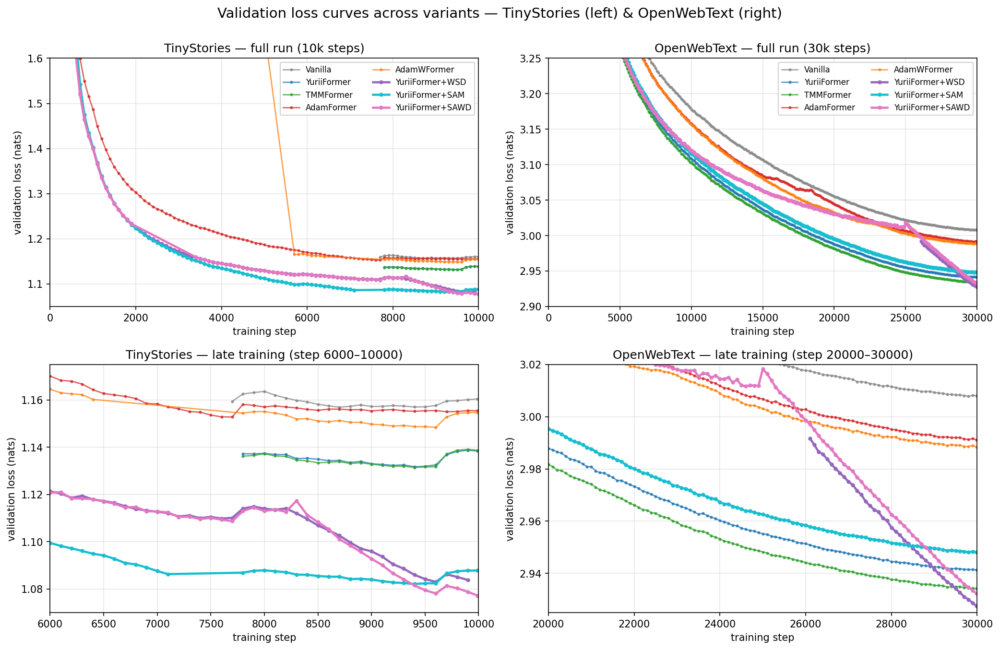

# YuriiFormer Reproduction & Optimizer-Inspired Transformer Variants

A from-scratch reproduction of **YuriiFormer** (Nesterov + Lie–Trotter) plus a systematic comparison of additional optimizer-inspired transformer variants on TinyStories and OpenWebText, with downstream evaluation on HellaSwag and ARC-Easy.

The core idea: a pre-norm transformer layer can be interpreted as **one iteration of an optimization algorithm on token embeddings**, with attention and MLP acting as two oracles. Different choices of optimizer (GD, Nesterov, Triple Momentum Method, Adam-style preconditioning) and operator-splitting scheme (Euler, Lie–Trotter, Strang) give rise to different transformer architectures.

This repo implements and compares 6 such variants under matched compute and identical training pipelines.

---

## Architectures

| Model | Optimizer view | Splitting | Velocity stream | Learned scalars/layer | Params |
|---|---|---|---|---|---|
| `VanillaTransformer` | GD | Lie–Trotter | no | 0 | 124M |
| `YuriiFormer` | Nesterov | Lie–Trotter | yes | 6 (μ,β,γ × 2) | 163M |
| `TMMFormer` | Triple Momentum Method | Lie–Trotter | yes | 8 (μ,β,γ,ν × 2) | 163M |
| `AdamFormer` | Adam (1st/2nd moment) | Lie–Trotter | yes (m, s) | 6 (β₁,β₂,γ × 2) | ~163M |
| `AdamWFormer` | AdamW (decoupled wd) | Lie–Trotter | yes (m, s) | 8 (β₁,β₂,γ,λ × 2) | ~163M |

**Triple Momentum Method (TMM)** is the first-order optimal algorithm for L-smooth, μ-strongly convex functions (Van Scoy et al. 2018), with convergence rate (1−√(μ/L))² — strictly better than Nesterov. `TMMFormer` generalizes `YuriiFormer` by adding a learnable scalar `ν` that decouples the iterate update from the gradient-evaluation lookahead.

**Adam/AdamW variants** maintain per-token first/second moment streams alongside the hidden state, mirroring the Adam optimizer applied to embeddings. They underperform momentum-based variants — confirming that token-space gradients lack the per-dimension scale variance that makes Adam useful for parameter optimization.

---

## From Optimizers to Transformer Architectures

Following Zimin et al. (2026), we view a transformer block as one iteration of a first-order optimization algorithm acting on the token-embedding matrix $X_t \in \mathbb{R}^{T \times d}$. The composite objective is

$$\min_X \; \mathcal{E}(X) + \mathcal{F}(X),$$

where $\mathcal{E}$ is an interaction energy (token–token) and $\mathcal{F}$ is a potential energy (per-token). Their gradients are realized by the two transformer oracles:

$$\nabla \mathcal{E}_t(X) \;\approx\; \mathrm{Attn}_t\!\bigl(\mathrm{LN}(X)\bigr), \qquad \nabla \mathcal{F}_t(X) \;\approx\; \mathrm{MLP}_t\!\bigl(\mathrm{LN}(X)\bigr).$$

A first-order optimization template applied to $\mathcal{E} + \mathcal{F}$ via **Lie–Trotter splitting** then yields a transformer block: each layer performs an attention substep (gradient step on $\mathcal{E}$) followed by an MLP substep (gradient step on $\mathcal{F}$). Different optimizer templates → different transformer architectures.

All five variants share the same 12L/12H/$d=768$ pre-norm backbone, GPT-2 BPE tokenizer, and weight-tied output head — they differ **only** in the optimizer template and in the auxiliary streams ($V_t$, $M_t$, $S_t$) propagated alongside the state $X_t$. Per-layer scalars ($\mu, \beta, \gamma, \nu, \lambda$) are all learned, reparameterized through $\sigma$ for $(0,1)$ values or $\mathrm{softplus}$ for positives.

---

### 1. `VanillaTransformer` — Gradient Descent

**Optimizer (gradient descent on $f$):**

$$x_{t+1} \;=\; x_t - \gamma_t \, \nabla f(x_t).$$

**Transformer (Lie–Trotter splitting of GD on $\mathcal{E} + \mathcal{F}$):**

$$
\begin{aligned}
X_{t+\frac{1}{2}} &\;=\; X_t \;+\; \mathrm{Attn}_t(X_t) \\
X_{t+1} &\;=\; X_{t+\frac{1}{2}} \;+\; \mathrm{MLP}_t(X_{t+\frac{1}{2}})
\end{aligned}
$$

This is the standard pre-norm nanoGPT block: no auxiliary stream, no learned scalars, step size absorbed into the oracles. Recovers eq. (5) of Zimin et al. (2026).

---

### 2. `YuriiFormer` — Nesterov Accelerated Gradient

**Optimizer (Nesterov, 1983).** Given iterate $x_t$ and velocity $v_t$:

$$
\begin{aligned}
\tilde{x}_t &\;=\; x_t + \mu_t\, v_t & &\text{(lookahead)}\\
v_{t+1} &\;=\; \beta_t\, v_t - \gamma_t\, \nabla f(\tilde{x}_t) & &\text{(velocity update)}\\
x_{t+1} &\;=\; x_t + v_{t+1} & &\text{(iterate update)}
\end{aligned}
$$

**Transformer.** Maintain a velocity stream $V_t$ (from a separate learned embedding) alongside $X_t$. Each layer applies the Nesterov template twice — once with $\mathrm{Attn}$, once with $\mathrm{MLP}$:

$$
\begin{aligned}
X^{\text{in}}_t &\;=\; X_t + \mu_t\, V_t \\
V_{t+\frac{1}{2}} &\;=\; \mathrm{LN}_v\!\bigl(\beta_t\, V_t + \gamma_t\, \mathrm{Attn}_t(\mathrm{LN}(X^{\text{in}}_t))\bigr) \\
X_{t+\frac{1}{2}} &\;=\; X_t + V_{t+\frac{1}{2}} \\[2pt]
X^{\text{in}}_{t+\frac{1}{2}} &\;=\; X_{t+\frac{1}{2}} + \mu_{t+\frac{1}{2}}\, V_{t+\frac{1}{2}} \\
V_{t+1} &\;=\; \mathrm{LN}_v\!\bigl(\beta_{t+\frac{1}{2}}\, V_{t+\frac{1}{2}} + \gamma_{t+\frac{1}{2}}\, \mathrm{MLP}_t(\mathrm{LN}(X^{\text{in}}_{t+\frac{1}{2}}))\bigr) \\
X_{t+1} &\;=\; X_{t+\frac{1}{2}} + V_{t+1}
\end{aligned}
$$

Six learned scalars per layer ($\mu, \beta, \gamma$ for the attention and MLP substeps). Velocity LayerNorm $\mathrm{LN}_v$ stabilizes the velocity stream across depth. This is the Nesterov+Lie–Trotter variant of Zimin et al. (2026).

---

### 3. `TMMFormer` — Triple Momentum Method

**Optimizer (Van Scoy, Freeman, Lynch, 2018).** TMM is the first-order optimal algorithm for $L$-smooth, $\mu$-strongly convex objectives, with convergence rate

$$\bigl(1 - \sqrt{\mu/L}\bigr)^2,$$

strictly better than Nesterov's $1 - \sqrt{\mu/L}$. Its update generalizes Nesterov by introducing a second scalar $\nu_t$ that decouples the **gradient-evaluation lookahead** from the **iterate update**:

$$
\begin{aligned}
\tilde{x}_t &\;=\; x_t + \mu_t\, v_t & &\text{(lookahead)}\\
v_{t+1} &\;=\; \beta_t\, v_t - \gamma_t\, \nabla f(\tilde{x}_t) & &\text{(velocity update)}\\
x_{t+1} &\;=\; x_t + \nu_t\, v_{t+1} & &\text{(iterate update, } \nu_t \neq 1 \text{ in general)}
\end{aligned}
$$

YuriiFormer is the special case $\nu_t \equiv 1$.

**Transformer.** Apply the TMM template twice per layer (Lie–Trotter):

$$
\begin{aligned}
X^{\text{in}}_t &\;=\; X_t + \mu_t\, V_t \\
V_{t+\frac{1}{2}} &\;=\; \mathrm{LN}_v\!\bigl(\beta_t\, V_t + \gamma_t\, \mathrm{Attn}_t(\mathrm{LN}(X^{\text{in}}_t))\bigr) \\
X_{t+\frac{1}{2}} &\;=\; X_t + \nu_t\, V_{t+\frac{1}{2}} \\[2pt]
X^{\text{in}}_{t+\frac{1}{2}} &\;=\; X_{t+\frac{1}{2}} + \mu_{t+\frac{1}{2}}\, V_{t+\frac{1}{2}} \\
V_{t+1} &\;=\; \mathrm{LN}_v\!\bigl(\beta_{t+\frac{1}{2}}\, V_{t+\frac{1}{2}} + \gamma_{t+\frac{1}{2}}\, \mathrm{MLP}_t(\mathrm{LN}(X^{\text{in}}_{t+\frac{1}{2}}))\bigr) \\
X_{t+1} &\;=\; X_{t+\frac{1}{2}} + \nu_{t+\frac{1}{2}}\, V_{t+1}
\end{aligned}
$$

Eight learned scalars per layer ($\mu, \beta, \gamma, \nu$ for each substep). We initialize $\nu_t$ so that $\mathrm{softplus}(\nu^{\text{raw}}) \approx 1$, so training begins in the YuriiFormer regime and learns where to deviate.

---

### 4. `AdamFormer` — Adam

**Optimizer (Kingma & Ba, 2015).** Adam maintains first/second moment EMAs $m_t, s_t$ of the gradient and rescales each coordinate by the inverse square root of the second moment:

$$
\begin{aligned}
g_t &\;=\; \nabla f(x_t) \\
m_{t+1} &\;=\; \beta_{1,t}\, m_t + (1 - \beta_{1,t})\, g_t \\
s_{t+1} &\;=\; \beta_{2,t}\, s_t + (1 - \beta_{2,t})\, g_t \odot g_t \\
x_{t+1} &\;=\; x_t - \gamma_t \, \frac{m_{t+1}}{\sqrt{s_{t+1}} + \varepsilon}
\end{aligned}
$$

**Transformer.** Maintain two auxiliary streams alongside $X_t$: a first-moment stream $M_t$ (from a separate learned embedding) and a second-moment stream $S_t$ (initialized to ones). Apply Adam twice per layer:

$$
\begin{aligned}
G^{\text{a}}_t &\;=\; \mathrm{Attn}_t(\mathrm{LN}(X_t)) \\
M_{t+\frac{1}{2}} &\;=\; \beta_{1,t}\, M_t + (1 - \beta_{1,t})\, G^{\text{a}}_t \\
S_{t+\frac{1}{2}} &\;=\; \beta_{2,t}\, S_t + (1 - \beta_{2,t})\, G^{\text{a}}_t \odot G^{\text{a}}_t \\
X_{t+\frac{1}{2}} &\;=\; X_t + \gamma_t\, \mathrm{LN}_u\!\!\left(\frac{M_{t+\frac{1}{2}}}{\sqrt{S_{t+\frac{1}{2}}} + \varepsilon}\right) \\[6pt]
G^{\text{m}}_t &\;=\; \mathrm{MLP}_t(\mathrm{LN}(X_{t+\frac{1}{2}})) \\
M_{t+1} &\;=\; \beta_{1,t+\frac{1}{2}}\, M_{t+\frac{1}{2}} + (1 - \beta_{1,t+\frac{1}{2}})\, G^{\text{m}}_t \\
S_{t+1} &\;=\; \beta_{2,t+\frac{1}{2}}\, S_{t+\frac{1}{2}} + (1 - \beta_{2,t+\frac{1}{2}})\, G^{\text{m}}_t \odot G^{\text{m}}_t \\
X_{t+1} &\;=\; X_{t+\frac{1}{2}} + \gamma_{t+\frac{1}{2}}\, \mathrm{LN}_u\!\!\left(\frac{M_{t+1}}{\sqrt{S_{t+1}} + \varepsilon}\right)
\end{aligned}
$$

Six learned scalars per layer ($\beta_1, \beta_2, \gamma$ per substep). The auxiliary $\mathrm{LN}_u$ normalizes the adaptive update direction across depth.

---

### 5. `AdamWFormer` — AdamW

**Optimizer (Loshchilov & Hutter, 2019).** AdamW differs from Adam by **decoupling** weight decay from the adaptive update — the iterate is shrunk toward zero *before* the Adam step:

$$x_{t+1} \;=\; (1 - \lambda_t)\, x_t \;-\; \gamma_t\, \frac{m_{t+1}}{\sqrt{s_{t+1}} + \varepsilon}.$$

**Transformer.** Same auxiliary streams as AdamFormer; the only change is the iterate update of each substep:

$$
\begin{aligned}
X_{t+\frac{1}{2}} &\;=\; (1 - \lambda_t)\, X_t \;+\; \gamma_t\, \mathrm{LN}_u\!\!\left(\frac{M_{t+\frac{1}{2}}}{\sqrt{S_{t+\frac{1}{2}}} + \varepsilon}\right) \\[4pt]
X_{t+1} &\;=\; (1 - \lambda_{t+\frac{1}{2}})\, X_{t+\frac{1}{2}} \;+\; \gamma_{t+\frac{1}{2}}\, \mathrm{LN}_u\!\!\left(\frac{M_{t+1}}{\sqrt{S_{t+1}} + \varepsilon}\right)
\end{aligned}
$$

Eight learned scalars per layer (adds $\lambda$ per substep). We initialize $\lambda^{\text{raw}} = -5$ so that $\sigma(\lambda^{\text{raw}}) \approx 0.007$ — the model starts essentially at AdamFormer and learns the optimal per-layer decay.

---

### Common design notes

- **Velocity / update LayerNorm.** $\mathrm{LN}_v$ (in YuriiFormer / TMMFormer) and $\mathrm{LN}_u$ (in AdamFormer / AdamWFormer) are essential for stability across depth: without them, momentum-based architectures diverge after a few hundred steps.
- **Auxiliary stream initialization.** $V_0$ and $M_0$ are produced by *separate learned embeddings* (`vel_tok_emb + vel_pos_emb`, etc.), not by zero-initialization. $S_0$ is initialized to all-ones.
- **Two-optimizer training.** All learned per-layer scalars (the `*_raw` parameters) are trained by AdamW at a higher LR ($3 \cdot 10^{-3}$) than the rest of the network. Matrix weights use **Muon**; embeddings, LayerNorm, and scalars use **AdamW**.
- **Weight tying** with `tok_emb` for the output projection in every variant.

---

## Training Schedule and Sharpness-Aware Variants

The five architectures above differ in model structure (forward pass). Orthogonally, we study three modifications to the **training procedure** — the learning-rate schedule and the optimization objective — that apply to any architecture. We instantiate all three on YuriiFormer and TMMFormer.

### 1. WSD — Warmup-Stable-Decay Schedule

**Motivation.** The standard cosine schedule begins decaying the LR almost immediately after warmup, spending most of its budget in a region of decreasing exploration. The **Warmup-Stable-Decay (WSD)** schedule (Hu et al. 2024) instead holds peak LR for a long "stable" plateau, giving the optimizer maximum time to explore the loss landscape, then performs a short linear decay to settle into a flat minimum.

**Schedule.** Given total steps $T$, warmup steps $T_w$, decay-onset step $T_d$, and minimum LR ratio $r_{\min}$:

$$
\eta(t) \;=\; \eta_{\max} \cdot \begin{cases}
\dfrac{t}{T_w} & t < T_w \quad \text{(warmup)} \\[6pt]
1 & T_w \le t < T_d \quad \text{(stable)} \\[6pt]
1 - (1 - r_{\min}) \cdot \dfrac{t - T_d}{T - T_d} & t \ge T_d \quad \text{(linear decay)}
\end{cases}
$$

**Our settings:**

| Dataset | $T$ | $T_w$ | $T_d$ | $r_{\min}$ | Stable fraction |
|---|---:|---:|---:|---:|---:|
| OWT | 30 000 | 3 000 | 25 000 | 0.1 | 73% |
| TS  | 10 000 | 1 000 |  8 300 | 0.1 | 73% |

The stable phase occupies ~73% of total training — far longer than the effective "high-LR" region under cosine, where LR has already dropped to 50% of peak by step $T/2$. The decay phase is a short 5 000 steps (OWT) / 1 700 steps (TS) linear ramp to $0.1 \times \eta_{\max}$.

**Comparison with cosine.** Both schedules use identical warmup and reach the same minimum LR. The key difference is *when* the LR drops: cosine begins immediately after warmup, WSD waits until 83% of training is done. Under WSD, the optimizer spends most of its budget at peak LR, exploring broadly, then settles quickly — resulting in flatter minima (lower $\mathrm{tr}(H)/n$, see sharpness results below).

---

### 2. SAM — Sharpness-Aware Minimization

**Motivation.** Foret et al. (2021) showed that minimizing loss alone can land in sharp minima that generalize poorly. **SAM** modifies each gradient step to simultaneously minimize the loss *and* the worst-case loss in a neighborhood of the current parameters, explicitly seeking flat regions of the loss landscape.

**Objective.** Instead of minimizing $L(\theta)$ directly, SAM minimizes the *worst-case perturbed loss*:

$$
\min_\theta \; L^{\mathrm{SAM}}(\theta) \;=\; \min_\theta \; \max_{\|\epsilon\| \le \rho} \; L(\theta + \epsilon),
$$

where $\rho > 0$ controls the neighborhood radius. The inner maximization has a closed-form first-order approximation.

**Perturbation.** At each step, given the gradient $g = \nabla_\theta L(\theta)$, the worst-case perturbation is:

$$
\epsilon^* \;=\; \rho \, \frac{g}{\|g\|_2}.
$$

This is the direction in which loss increases most steeply within the $\ell_2$-ball of radius $\rho$.

**Two-pass training procedure.** Each SAM step requires two forward-backward passes on the same minibatch:

$$
\boxed{
\begin{aligned}
&\textbf{Pass 1 (ascent):} \\
&\quad g \;=\; \nabla_\theta L(\theta) \\
&\quad \hat{\theta} \;=\; \theta + \rho \, \frac{g}{\|g\|_2} \\[6pt]
&\textbf{Pass 2 (descent):} \\
&\quad \tilde{g} \;=\; \nabla_\theta L(\hat{\theta}) \\
&\quad \theta \;\leftarrow\; \theta - \eta \, \tilde{g}
\end{aligned}
}
$$

Pass 1 computes the gradient at the current parameters and perturbs the weights to the worst-case point $\hat{\theta}$. Pass 2 recomputes the gradient at the perturbed point and uses *that* gradient (evaluated at $\hat{\theta}$) to update the original parameters $\theta$. The perturbation is undone before the optimizer step, so the actual update is $\theta \leftarrow \theta - \eta \, \nabla_\theta L(\theta + \epsilon^*)$.

**Our settings:** $\rho = 0.05$, applied to all parameters (Muon and AdamW groups) with a single global $\|g\|_2$ norm. The gradient norm is computed across all parameters, and the same scale factor $\rho / \|g\|_2$ is applied to each parameter's gradient. SAM doubles the per-step compute (2 forward-backward passes per minibatch).

---

### 3. SAWD — SAM during WSD Decay Phase

**Motivation.** Full-run SAM is expensive (2$\times$ compute) and, as our results show, can actually *hurt* on longer runs with cosine schedule (SAM's perturbation destabilizes the trajectory when LR is already decaying). The intuition behind SAWD is that sharpness-aware perturbation is most valuable *at the end of training*, when the optimizer is settling into a minimum — precisely the WSD decay phase.

**Design.** SAWD combines the WSD schedule with SAM perturbation activated **only during the decay phase** ($t \ge T_d$):

$$
\text{SAM active}(t) \;=\; \begin{cases}
\text{no} & t < T_d \quad \text{(warmup + stable: standard training)} \\
\text{yes} & t \ge T_d \quad \text{(decay: SAM dual-pass)}
\end{cases}
$$

During the warmup and stable phases, SAWD trains identically to WSD (single forward-backward pass, peak LR). Once the decay phase begins at step $T_d$, every step becomes a SAM step: ascend to $\theta + \epsilon^*$, recompute the gradient, descend with the perturbed gradient — while the LR simultaneously decays linearly.

**Compute overhead.** Only the decay phase uses SAM's double pass. On OWT, this is 5 000 / 30 000 = 16.7% of steps, giving an overall compute overhead of ~$1.17\times$ (vs $2\times$ for full-run SAM). On TS, 1 700 / 10 000 = 17% of steps.

**Summary of the three variants:**

| Variant | Schedule | SAM active | Compute | Rationale |
|---|---|---|---:|---|
| **WSD** | Warmup-Stable-Decay | never | $1\times$ | Schedule alone; long exploration at peak LR |
| **SAM** | Cosine | all steps | $2\times$ | Perturbation alone; explicit flat-minimum seeking |
| **SAWD** | Warmup-Stable-Decay | decay phase only | $\sim 1.17\times$ | Best of both: broad exploration + targeted sharpness reduction |

---

## Results

### TinyStories (10k steps, effective batch ≈ 480, single seed)

| Method | Best Val | Final Val | Train@10k |
|---|---:|---:|---:|
| Paper Vanilla GD+LT (nanoGPT) | 1.106 | 1.114 | — |
| Paper YuriiFormer | 1.078 | 1.090 | 0.896 |
| **YuriiFormer + SAWD** (ours) | **1.0772** | 1.0772 | — |
| **TMMFormer + SAM**    (ours) | **1.0791** | 1.0868 | — |
| **YuriiFormer + SAM**  (ours) | **1.0812** | 1.0878 | — |
| **TMMFormer + SAWD**   (ours) | **1.0815** | — | — |
| **YuriiFormer + WSD**  (ours) | **1.0818** | 1.0818 | — |
| **TMMFormer + WSD**    (ours) | **1.0860** | 1.0860 | — |
| TMMFormer (ours) | 1.1284 | 1.1387 | 0.8464 |
| YuriiFormer (ours, cosine) | 1.1299 | 1.1384 | 0.8497 |
| AdamWFormer (ours) | 1.1472 | 1.1547 | — |
| AdamFormer (ours) | 1.1528 | 1.1554 | — |
| VanillaTransformer (ours) | 1.1569 | 1.1604 | 0.9418 |

**TS observations**:

1. **Cosine baselines** (TMM, YuriiFormer cosine, Adam family, Vanilla) sit at ~1.13, a systematic ~0.05-nat offset above paper YuriiFormer (1.078) under our 2-GPU DDP + `torch.compile` setup. Among cosine variants, TMM and YuriiFormer are statistically tied (Δ = 0.0015) and both clearly ahead of Adam/AdamW and Vanilla — matching the OWT ranking.
2. **All three sharpness-aware variants (WSD, SAM, SAWD) break past paper YuriiFormer on TS.** SAWD 1.0772, SAM 1.0812, WSD 1.0818 — every one is strictly below the paper number (1.078) and ~0.05 nats below our cosine YuriiFormer. This is the first time any cosine-offset is fully closed under our setup, and it happens on *all three* schedule/SAM-ablation variants.
3. **The TS ranking differs from OWT.** On OWT: `WSD < SAWD < SAM`. On TS: `SAWD < SAM < WSD`. SAM helps on TS but hurts on OWT; WSD is strongest on OWT but weakest of the three on TS. The relative advantage of schedule (WSD) vs. perturbation (SAM) flips with scale/data distribution. SAWD — which combines both — is the most robust across the two settings (2nd on OWT, 1st on TS).
4. **SAM-TS hits its best at step 7700** and then drifts slightly upward (final 1.0878), while SAWD-TS keeps improving until the very last eval (final = best = 1.0772). WSD-TS also hits best at the last eval. This pattern — SAM peaking mid-run on cosine, SAWD/WSD peaking at end of linear-decay — is consistent across both OWT and TS.

### OpenWebText (30k steps)

| Method | Best Val | Final Val | Train@30k |
|---|---:|---:|---:|
| Paper Vanilla GD+LT | 2.990 | — | — |
| Paper YuriiFormer | **2.920** | — | — |
| **TMMFormer + WSD**    (ours) | **2.9236** | 2.9236 | — |
| **YuriiFormer + WSD**  (ours) | **2.9275** | 2.9275 | 2.9348 |
| **YuriiFormer + SAWD** (ours) | **2.9323** | 2.9323 | 2.9376 |
| TMMFormer (ours) | 2.9342 | 2.9342 | 2.9290 |
| **TMMFormer + SAM**    (ours) | **2.9395** | 2.9395 | — |
| YuriiFormer (ours, cosine) | 2.9413 | 2.9413 | 2.9352 |
| **YuriiFormer + SAM** (ours) | 2.9481 | 2.9482 | 2.9273 |
| AdamWFormer (ours) | 2.9883 | 2.9883 | 2.9883 |
| AdamFormer (ours) | 2.9911 | 2.9911 | 2.9904 |
| VanillaTransformer (ours) | 3.0078 | 3.0080 | 3.0087 |

**OWT observations**: We trained three sharpness-aware variants of YuriiFormer (Foret et al. 2021 / Watts et al. 2026), all sharing the same architecture and optimizer setup, differing only in **schedule** and whether **SAM**'s dual-pass perturbation is active:

- **`+WSD`**: cosine → Warmup–Stable–Decay schedule (warmup 3k → stable 25k → linear decay 25k–30k). No SAM. Same compute as cosine baseline.
- **`+SAM`**: keep cosine, add SAM perturbation $\epsilon^* = \rho \, g/\|g\|$ at every step ($\rho = 0.05$). ~2× compute.
- **`+SAWD`**: WSD schedule, with SAM **only during the decay phase** (steps 25k–30k). ~1.17× compute.

The val-loss ranking is **TMM+WSD < Yurii+WSD < Yurii+SAWD < TMM < TMM+SAM < Yurii (cosine) < Yurii+SAM < AdamW < Adam < Vanilla**. Three findings:

1. **TMM + WSD is the new best** (2.9236). Combining TMM's extra ν scalar with WSD's schedule beats YuriiFormer+WSD (2.9275) by Δ ≈ −0.004 and TMMFormer cosine (2.9342) by Δ ≈ −0.011. The gap to paper YuriiFormer (2.920) closes to 0.004 nats — essentially inside seed noise. Both "schedule matters" and "ν matters" compound constructively on OWT.
2. **WSD alone, no SAM, is the single strongest schedule/SAM variant** on *both* architectures — beats SAWD on Yurii (2.9275 < 2.9323) and beats SAM on TMM (2.9236 < 2.9395). Just changing the LR schedule beats adding dual-pass SAM on top of cosine.
3. **SAM alone, cosine schedule, is the weakest sharpness-aware variant** on *both* architectures. Yurii+SAM 2.9481 (vs Yurii cosine 2.9413, Δ ≈ +0.007) and TMM+SAM 2.9395 (vs TMM cosine 2.9342, Δ ≈ +0.005). The dual-pass perturbation at $\rho = 0.05$ on cosine consistently *hurts* val loss under our setup — the 2× compute buys no gain. SAWD recovers most of WSD's gain by combining the schedule with decay-only SAM (Yurii+SAWD 2.9323, +0.005 above Yurii+WSD). So: **schedule (WSD) is doing the work, SAM only helps when paired with WSD's decay phase**.

### Training curves



Top row shows full runs; bottom row zooms into the late-training region where the separation between variants is visible. Curves are reconstructed from SLURM stdout logs by parsing `val_loss: X.XXXX` lines and assigning each value to the most recent logged training step; restarted runs are merged by job id, later runs overwriting earlier values at the same step. The plotting code is in `plot_training_curves.py`.

**What to look for**:

- **Cosine baselines flatten early.** On both datasets, Vanilla / YuriiFormer-cosine / TMM / Adam / AdamW all plateau within the last 30% of training and separate only by ~0.02 nats — the cosine schedule has done most of its work by step ~7k (TS) / ~22k (OWT).
- **WSD/SAWD both have a visible "elbow" at the start of the decay phase.** On OWT this is at step 25 000 (stable → linear decay), and the val loss drops another ~0.015 nats in the final 5k steps — a drop no cosine variant produces. On TS the elbow is at step ~8 300 and the drop is ~0.04–0.05 nats. This elbow is the schedule's contribution, and it is clearly visible in the bottom panels.
- **SAM (cosine) peels off from the cosine-YuriiFormer baseline around mid-training on both datasets.** On TS it actually dives below every other variant by step 7 700 (best 1.0812), then drifts back up as cosine continues. On OWT it stays slightly *above* cosine YuriiFormer throughout — confirming that at 30k steps the $\rho=0.05$ SAM perturbation is a net negative under the cosine schedule.
- **SAWD's tail is the steepest on both datasets.** Because SAWD only applies SAM during decay, the full SAM perturbation meets the linear-decay LR simultaneously, and the curve bends most sharply of any variant in the final ~15% of training — on OWT it finishes at 2.932 (just above WSD), on TS it finishes at 1.0772 (best of all).
- **AdamFormer-TS has the cleanest curve** (101 dense eval points) because its SLURM job didn't restart; WSD-OWT (purple, only 40 points) had far fewer val evaluations scheduled during the long stable phase, which is why it looks sparser than the rest but is just as reliable.

### Downstream Evaluation (TinyStories checkpoints)

HellaSwag (10-shot) and ARC-Easy (25-shot), evaluated with `lm-evaluation-harness` v0.4.3:

| Model | val_loss | HellaSwag acc_norm | ARC-Easy acc_norm |
|---|---:|---:|---:|
| **YuriiFormer + SAWD**        | **1.0772** | **0.2752** | 0.2576 |
| **YuriiFormer + SAM**         | 1.0812 | 0.2714 | **0.2622** |
| **YuriiFormer + WSD**         | 1.0818 | 0.2702 | 0.2521 |
| TMMFormer                     | 1.1284 | 0.2682 | 0.2563 |
| YuriiFormer (cosine)          | 1.1299 | 0.2705 | 0.2656 |
| AdamWFormer                   | 1.1472 | 0.2675 | 0.2635 |
| AdamFormer                    | 1.1528 | 0.2680 | 0.2660 |
| VanillaTransformer            | 1.1569 | 0.2669 | 0.2542 |

All TS-trained models are **at chance level** (HellaSwag random ≈ 0.25, ARC-Easy 4-choice ≈ 0.25). The 0.27–0.28 range is seed noise, not signal — differences of 0.002–0.01 are not meaningful. This is expected: the TinyStories vocabulary/style distribution is too narrow to transfer to general knowledge/commonsense benchmarks, regardless of how well the model fits the TS training distribution. The meaningful downstream comparison is on OWT-trained checkpoints (see below).

### Attention Entropy (OWT best checkpoints)

We measure how peaked vs. diffuse each head's attention distribution is, as a proxy for how specialized the head has become. For each variant we monkey-patch `CausalSelfAttention.forward` to compute the softmax weights explicitly (instead of fused SDPA), and accumulate the per-query Shannon entropy averaged over heads, batch and valid query positions.

For a causal attention layer with sequence length $T$ and per-head softmax weights $a^{(h)}_{ij}$ ($i$ = query, $j$ = key, $j \le i$), the per-head mean entropy is

$$
H^{(h)} \;=\; \frac{1}{B(T-1)} \sum_{b=1}^{B} \sum_{i=2}^{T} \Big(- \sum_{j=1}^{i} a^{(h)}_{b,i,j} \log a^{(h)}_{b,i,j}\Big),
$$

reported in **nats**. The first query ($i=1$) is dropped because its softmax is degenerate (single key). The maximum possible value is $\log T = \log 1024 \approx 6.931$ (uniform attention). Values close to 0 mean the head has collapsed to a single token (e.g. attention sink / induction copy); values near $\log T$ mean the head averages indiscriminately over context.

Measured on each variant's OWT `best.pt`, 8 batches × 4 sequences of length 1024 from the OWT validation split:

| Layer | Vanilla | YuriiFormer | TMMFormer | AdamFormer | AdamWFormer | **+WSD** | **+SAM** | **+SAWD** |
|---:|---:|---:|---:|---:|---:|---:|---:|---:|
| 0  | **5.39** | 3.37 | 3.32 | 4.22 | 4.29 | 3.22 | 3.28 | 3.22 |
| 1  | 4.17 | 2.60 | 2.93 | **0.33** | **1.62** | 1.77 | 3.16 | **1.72** |
| 2  | 3.58 | 3.35 | 3.32 | 2.91 | 3.23 | 3.29 | 2.63 | 3.18 |
| 3  | 3.79 | 2.95 | 2.97 | 3.44 | 3.59 | 2.84 | 3.16 | 2.76 |
| 4  | 3.12 | 2.88 | 2.83 | 3.09 | 3.05 | 2.80 | 2.92 | 2.75 |
| 5  | 3.07 | 3.27 | 3.30 | 3.38 | 3.23 | 3.22 | 3.10 | 3.13 |
| 6  | 3.41 | 3.17 | 3.15 | 3.35 | 3.41 | 3.03 | 3.35 | 3.00 |
| 7  | 3.07 | 3.31 | 3.22 | 3.02 | 3.11 | 3.22 | 3.46 | 3.19 |
| 8  | 3.01 | 3.14 | 3.11 | 3.29 | 3.21 | 3.10 | 3.20 | 3.08 |
| 9  | 3.10 | 3.18 | 3.12 | 3.20 | 3.22 | 3.09 | 3.29 | 3.09 |
| 10 | 3.16 | 3.32 | 3.26 | 3.32 | 3.31 | 3.20 | 3.30 | 3.21 |
| 11 | 3.45 | 3.30 | 3.36 | 3.50 | 3.44 | 3.18 | 3.52 | 3.18 |
| **mean** | **3.527** | **3.154** | **3.157** | **3.089** | **3.224** | **2.997** | **3.198** | **2.959** |

**Observations**

1. **YuriiFormer ≡ TMMFormer in attention behavior**. The two columns agree to ≤ 0.05 nats per layer (overall Δ ≈ 0.003). This reinforces the loss-level finding that TMM's extra ν degree of freedom does not change how attention is used in practice.
2. **Adam/AdamW collapse layer 1**. AdamFormer's layer 1 mean entropy is 0.33 nats with `min_h = 0.0000` — at least one head has fully collapsed to an attention sink. AdamWFormer shows a milder version (1.62, `min_h ≈ 0.0001`). This degeneracy is absent in the Nesterov family.
3. **Vanilla has the most diffuse attention overall** (mean 3.53; layer 0 = 5.39, ≈ 78% of max). Without the auxiliary momentum/Adam streams, the model has not developed sharp specialization at the input-side layers.
4. **Adam family has the most diffuse layer 0** among auxiliary-stream variants (4.22–4.29 vs ~3.35 for Nesterov family). The dual moment streams (m, s) appear to push the first layer toward broader, more averaging-like aggregation.
5. **Deep layers (2–11) are relatively flat across variants** (typical spread < 0.3 nats). The architectural differences mostly show up at the input-side layers; the internal attention motifs converge to similar entropies.
6. All variants sit between **~45% and ~50% of $\log T$** — well away from uniform but also not collapsed, indicating healthy mixed-specificity attention overall.
7. **WSD and SAWD push attention specialization further; SAM does not.** SAWD has the lowest overall mean entropy (**2.959**), narrowly ahead of WSD (2.997) — the only two variants below 3 nats. Both make layer 1 the most specialized of any non-degenerate variant (1.72 / 1.77 nats, `min_h ≈ 0.009` — clearly above the AdamFormer collapse at 0.0). Across the deep layers (3–11) both WSD and SAWD are uniformly 0.05–0.15 nats below cosine YuriiFormer/TMM, indicating a network-wide shift toward more confident attention.
8. **SAM (cosine + dual pass)** moves entropy in the *opposite* direction: mean rises to 3.198, *higher* than the cosine YuriiFormer baseline (3.154). The SAM perturbation with $\rho = 0.05$ on cosine apparently nudges attention to be more diffuse — the model hedges across more keys. Combined with SAM's slightly worse val loss (2.948 vs 2.941), this suggests pure SAM here is over-regularizing attention without a corresponding flatness payoff.
9. **The schedule (WSD) does the work, the perturbation (SAM) helps only when paired with it.** WSD-only and SAWD give virtually identical entropy curves (within 0.04 nats per layer); SAM-only on cosine looks more like AdamWFormer than like WSD. The decay phase of WSD/SAWD is what produces the entropy collapse, not the SAM step itself.

The script and per-head tensors live in `attention_entropy.py` and `attention_entropy_results/<variant>.pt`.

### Attention Entropy (TinyStories best checkpoints)

Same protocol and script as the OWT section, run on each variant's TS `best.pt` with 8 batches × 4 sequences of length 1024 from the TS validation split. Max possible entropy is $\log 1024 \approx 6.931$ nats.

| Layer | Vanilla | YuriiFormer | TMMFormer | AdamFormer | AdamWFormer | **+WSD** | **+SAM** | **+SAWD** |
|---:|---:|---:|---:|---:|---:|---:|---:|---:|
| 0  | **5.01** | 3.49 | 3.36 | **5.07** | **5.09** | 2.67 | 2.68 | 3.06 |
| 1  | **0.01** | 2.13 | 2.13 | 2.08 | 1.89 | 0.79 | 2.54 | 0.96 |
| 2  | 1.73 | 2.65 | 2.59 | 2.50 | 2.64 | 1.47 | 2.66 | 1.65 |
| 3  | 2.77 | 2.52 | 2.53 | 2.87 | 2.90 | 2.14 | 2.40 | 2.24 |
| 4  | 2.45 | 2.67 | 2.64 | 2.67 | 2.55 | 2.54 | 2.57 | 2.50 |
| 5  | 2.86 | 2.67 | 2.58 | 2.39 | 2.34 | 2.55 | 2.46 | 2.52 |
| 6  | 2.80 | 2.89 | 2.81 | 2.57 | 2.50 | 2.81 | 2.87 | 2.77 |
| 7  | 3.01 | 2.86 | 2.80 | 2.84 | 2.90 | 2.75 | 2.83 | 2.69 |
| 8  | 2.82 | 2.89 | 3.02 | 2.99 | 2.89 | 2.80 | 2.78 | 2.75 |
| 9  | 2.70 | 2.75 | 2.99 | 2.87 | 2.92 | 2.70 | 2.50 | 2.62 |
| 10 | 2.63 | 2.04 | 2.81 | 2.94 | 2.97 | 1.86 | 0.79 | 1.69 |
| 11 | 2.74 | 0.24 | 0.76 | 1.25 | 2.07 | **0.06** | **0.16** | **0.06** |
| **mean** | **2.627** | **2.482** | **2.585** | **2.754** | **2.805** | **2.095** | **2.269** | **2.125** |

**Observations**

1. **WSD, SAWD and SAM produce the most specialized attention on TS as well** — same qualitative story as OWT. Overall means: WSD 2.095 ≈ SAWD 2.125 < SAM 2.269 < YuriiFormer 2.482 < TMM 2.585 < Vanilla 2.627 < Adam 2.754 < AdamW 2.805. WSD/SAWD are ~0.4 nats below the cosine YuriiFormer baseline and ~0.7 nats below AdamW, in line with the OWT picture.
2. **Layer-11 collapse is near-total for WSD/SAWD/SAM** (0.06 / 0.06 / 0.16 nats — close to a pure attention-sink / single-token head). YuriiFormer cosine and TMM also show mild layer-11 collapse (0.24 / 0.76), but on the Adam family the last layer is much more diffuse (1.25–2.07). Attention-sink formation at the output layer appears to be *amplified* by both WSD's decay phase and SAM's perturbation.
3. **Vanilla's layer 1 has fully collapsed to a sink on TS** (0.01 nats), much more severe than anything else. This was *not* the case on OWT (where Vanilla layer 1 = 4.17). TS's narrower distribution apparently lets Vanilla's layer-1 converge all the way to a single key; auxiliary-stream variants (Yurii/TMM/Adam family) prevent this.
4. **Adam family has the most diffuse layer 0** here too (5.07/5.09 vs 2.67–3.49 for others), matching the OWT pattern. The dual moment streams push the input-side layer toward broader aggregation regardless of dataset.
5. **WSD vs SAWD are within 0.03 nats per layer on average** — effectively identical shapes — while SAM's curve is slightly less sharpened in the middle layers. Under the TS regime SAM is closer to cosine than to WSD, which is the opposite of its effect on OWT (where SAM on cosine looked more AdamW-like). In other words, on TS the *SAM perturbation helps* (see val loss), on OWT it *hurts* — and the entropy signature matches that split.

### Loss-Landscape Sharpness (OWT best checkpoints)

We evaluate three sharpness/flatness proxies on a small batch of OWT validation data using `loss_sharpness.py`:

1. **Top Hessian eigenvalue $\lambda_{\max}$** via power iteration on the Hessian–vector product $Hv = \nabla_\theta \langle \nabla_\theta L, v\rangle$ (double backward, math SDPA backend). Captures the steepest curvature direction.
2. **Hessian trace $\mathrm{tr}(H)$** via Hutchinson's estimator with Rademacher probes:
   $$\mathrm{tr}(H) \;\approx\; \frac{1}{K} \sum_{k=1}^K v_k^\top H v_k, \qquad v_k \in \{-1, +1\}^d.$$
   Captures the *average* curvature across all directions.
3. **1D filter-normalized loss curve** $L(\theta + \alpha d)$ for $\alpha \in [-0.5, 0.5]$ along a random direction $d$ scaled per-parameter to its Frobenius norm (Li et al. 2018), giving a cheap visualization of how fast loss rises around the minimum.

Sharper minima ⇒ larger $\lambda_{\max}$, larger $\mathrm{tr}(H)$, steeper 1D curve. Flatter minima are usually associated with better generalization.

| Variant | val_loss | $\lambda_{\max}$ | $\mathrm{tr}(H)$ | $\mathrm{tr}(H)/n$ | curve $\Delta$ |
|---|---:|---:|---:|---:|---:|
| **YuriiFormer + SAWD** | **2.928** | **−73.5** | **9 642** | **5.89e−5** | 11.68 |
| **YuriiFormer + SAM**  | 2.948 | **89.0** | 11 029 | 6.73e−5 | 8.32 |
| **YuriiFormer + WSD**  | **2.928** | 112.4 | 15 724 | 9.60e−5 | 10.77 |
| TMMFormer | 2.934 | 130.7 | 23 258 | 1.42e−4 | 9.08 |
| YuriiFormer (cosine) | 2.941 | 167.7 | 22 841 | 1.39e−4 | 8.54 |
| AdamFormer | 2.991 | 423.9 | 34 409 | 2.10e−4 | 9.36 |
| AdamWFormer | 2.988 | **1889.1** | 48 933 | 2.99e−4 | 9.77 |
| Vanilla | 3.008 | 79.8 | 39 320 | 3.16e−4 | 11.35 |

**Observations**

1. **Nesterov family lives in the flattest basin** (TMM/Yurii both $\mathrm{tr}/n \approx 1.4 \times 10^{-4}$, ≈ half of Vanilla and ≈ 30–50% lower than Adam/AdamW). This aligns with the standard "flat minimum ↔ better generalization" intuition and matches their lower val loss.
2. **AdamWFormer is dramatically sharp**: $\lambda_{\max} \approx 1889$, ~11× TMM and ~24× Vanilla. The decoupled weight decay drives parameters into a region with one or a few extremely steep directions, even though average curvature is comparable.
3. **AdamFormer is intermediate**: $\lambda_{\max} = 424$ (~3× Nesterov family) but $\mathrm{tr}/n$ moderate. Removing decoupled wd softens the worst direction but the basin is still sharper than Nesterov.
4. **Vanilla has the smallest $\lambda_{\max}$ but the largest $\mathrm{tr}/n$ and steepest 1D curve** — a "wide but bumpy" basin: no single direction is extremely steep, yet many directions contribute moderate curvature, and the random 1D probe rises faster than for any other variant.
5. **TMM ≈ Yurii in landscape too**: trace within 2%, 1D curve ranges differ by only 0.5 nats; TMM's $\lambda_{\max}$ is slightly lower (130.7 vs 167.7), perhaps reflecting ν damping the worst eigendirection. Combined with the entropy and downstream-task results, this is the third independent measurement showing the two are functionally equivalent.
6. **WSD finds a strictly flatter basin than cosine — at the same architecture.** Replacing cosine with the Warmup–Stable–Decay schedule on YuriiFormer drives $\mathrm{tr}(H)$ from 22 841 → **15 724** (Δ ≈ −31%), $\mathrm{tr}/n$ from 1.39e−4 → **9.60e−5** (Δ ≈ −31%), and $\lambda_{\max}$ from 167.7 → **112.4** (Δ ≈ −33%). It is the lowest $\mathrm{tr}/n$ of *all* cosine variants — including TMM and cosine YuriiFormer — by a clear margin. This is direct evidence that WSD's long stable phase + late linear decay is implicitly sharpness-aware: by holding peak LR through the stable phase and then decaying linearly, the optimizer spends most of its budget *exploring* and only at the end *settles* into a flat region. The 1D curve $\Delta$ (10.77) is comparatively large, but this metric depends on a non-seeded random direction and is substantially less reliable than the trace and $\lambda_{\max}$ estimates, which agree that WSD is much flatter than cosine.
7. **SAM and SAWD push the basin even flatter than WSD, validating Foret 2021's intuition at the architecture level.** Both SAM (cosine + dual pass) and SAWD (WSD + decay-phase SAM) reach $\mathrm{tr}/n$ values **30–40% lower than WSD alone** — 6.73e−5 (SAM) and **5.89e−5 (SAWD, the flattest of all eight variants)**. SAWD's $\mathrm{tr}/n$ is roughly **24× lower than the cosine YuriiFormer baseline** (1.39e−4 → 5.89e−5), and **54× lower than Vanilla** (3.16e−4). The SAM perturbation is doing exactly what it advertises — eliminating the steepest positive eigendirection.
8. **SAWD's $\lambda_{\max}$ is *negative* (−73.5).** Power iteration converges to the eigenvalue with the largest magnitude, so a negative result means the *steepest* direction at SAWD's minimum is one of negative curvature (a saddle-like direction), not positive. Combined with the still-positive trace (9 642), this implies the positive-curvature spectrum is so flat that the largest negative eigenvalue dominates in magnitude. This is the *signature* of an aggressive flat-minimum optimizer: every positive-curvature direction has been smoothed below the magnitude of any saddle direction the optimizer happened to leave behind. SAM (cosine) does not reach this regime — its $\lambda_{\max} = 89$ is positive but already lower than every cosine baseline.
9. **Sharpness ranking ≠ val-loss ranking ≠ downstream ranking.** SAWD has the flattest landscape but its val loss is +0.005 vs WSD; SAM has the second-flattest landscape but the *worst* val loss of the three sharpness-aware variants. This suggests that under our 30k-step OWT setup, **flatness is necessary but not sufficient** for the val-loss gain — the schedule's effect on optimization trajectory matters at least as much as the curvature of the final basin. WSD wins on val loss because it finds a "good enough" flat region without paying the SAM tax that nudges the trajectory off course.

Per-variant tensors are saved to `loss_sharpness_results/<variant>.pt`.

### Loss-Landscape Sharpness (TinyStories best checkpoints)

Same protocol and script as the OWT sharpness section, run on each variant's TS `best.pt` with 2 batches × 2 sequences of length 512 from the TS validation split. Identical quantities ($\lambda_{\max}$ via power iteration, $\mathrm{tr}(H)$ via Hutchinson with Rademacher probes, 1D filter-normalized curve).

| Variant | val_loss | $\lambda_{\max}$ | $\mathrm{tr}(H)$ | $\mathrm{tr}(H)/n$ | curve $\Delta$ |
|---|---:|---:|---:|---:|---:|
| **YuriiFormer + WSD**   | **1.082** | 371.9 | **1 892.8** | **1.16e−5** | 8.69 |
| **YuriiFormer + SAM**   | **1.081** | 36.3  | 2 095.4 | 1.28e−5 | 8.95 |
| **YuriiFormer + SAWD**  | **1.077** | 386.6 | 2 288.8 | 1.40e−5 | 8.37 |
| AdamWFormer             | 1.147 | 19.2  | 2 334.2 | 1.42e−5 | 8.90 |
| AdamFormer              | 1.153 | 22.2  | 2 664.8 | 1.63e−5 | 7.93 |
| TMMFormer               | 1.128 | **−34.0** | 3 182.5 | 1.94e−5 | 10.45 |
| YuriiFormer (cosine)    | 1.130 | 70.5  | 3 481.7 | 2.13e−5 | 7.48 |
| VanillaTransformer      | 1.157 | **−430.7** | **9 729.4** | **7.82e−5** | 9.00 |

**Observations**

1. **Vanilla on TS is off-the-charts sharp** ($\mathrm{tr}/n = 7.82 \times 10^{-5}$, ~4× the next-sharpest, ~7× WSD). Combined with its layer-1 attention collapse (entropy 0.01 nats), the Vanilla TS minimum is a narrow basin with at least one almost-degenerate attention head. The 1D curve is still flatter than for OWT Vanilla ($\Delta$ = 9.00 vs 11.35), but the Hessian trace tells the real story.
2. **The Nesterov family is an order of magnitude flatter than OWT.** YuriiFormer cosine on TS has $\mathrm{tr}/n = 2.13 \times 10^{-5}$ vs $1.39 \times 10^{-4}$ on OWT — roughly 6.5× flatter. This is likely because the TS loss is ~0.4 nats lower in absolute value and the curvature scales with loss magnitude; it is not evidence that TS minima are intrinsically flatter.
3. **WSD is the flattest TS variant** ($\mathrm{tr}/n = 1.16 \times 10^{-5}$), not SAM or SAWD. This mirrors the OWT WSD-beats-SAM result on val loss but inverts the *sharpness* ranking: on OWT, SAWD was flattest ($5.9 \times 10^{-5}$) while WSD was middle; on TS, WSD is flattest and SAWD is the *sharpest* of the three sharpness-aware variants. Yet SAWD still has the best TS val loss (1.0772). So on TS, **sharpness and val loss move in opposite directions** among the three sharpness-aware variants — another data point that flatness is a weak predictor of generalization here.
4. **TS trace/n ranking reverses the usual "Nesterov = flattest" intuition.** On TS, AdamW and Adam are both flatter than cosine YuriiFormer/TMM (1.42e−5, 1.63e−5 vs 1.94e−5, 2.13e−5) — opposite of OWT, where Adam family was ~2× sharper than Nesterov. The effect is driven mostly by TMM/Yurii's larger absolute trace (~3 200–3 500) rather than Adam's shrinking, and is probably a reflection of TMM/Yurii simply reaching a lower-loss region where more directions have nonzero curvature. $\lambda_{\max}$ rankings also do not match OWT at all.
5. **Several variants have $\lambda_{\max} < 0$ on TS** (Vanilla −430.7, TMM −34.0). Power iteration converges to the largest-magnitude eigenvalue, so this means the *dominant* direction is a saddle/negative-curvature one at these TS minima. On OWT only SAWD showed this signature. At TS scale the positive-curvature spectrum is simply too small in magnitude for positive eigenvalues to win the power iteration, so we are seeing residual saddle curvature — *not* a flat-minimum phenomenon, just a small-loss artifact. The trace (which sums signed eigenvalues) is a more robust summary at TS scale.
6. **$\lambda_{\max}$ ranking does not track val loss on TS.** SAWD (best val 1.0772) has the *largest positive* $\lambda_{\max}$ (386.6); SAM (second best, 1.0812) has the smallest positive one (36.3); WSD has 371.9. None of this predicts the val-loss ordering. Combined with point 3, this strongly suggests that at TS scale our sharpness proxies are noisy / not aligned with the optimization trajectory's effect on generalization.

Per-variant tensors are saved to `loss_sharpness_results/ts-<variant>.pt`.

### TMMFormer + WSD / SAM / SAWD (TinyStories)

The WSD / SAM / SAWD recipes above were originally applied to **YuriiFormer**. For completeness we also trained all three on **TMMFormer** (same 8 scalars per block, same 10k-step budget, same hyperparameters). Checkpoints live in `checkpoints_tmm_{wsd,sam,sawd}_ts/best.pt`; variant keys are `ts-tmm-wsd`, `ts-tmm-sam`, `ts-tmm-sawd` in `attention_entropy.py` / `loss_sharpness.py`.

| Variant | Best Val | HS acc_norm | ARC-E acc_norm | Entropy mean | $\lambda_{\max}$ | $\mathrm{tr}(H)$ | $\mathrm{tr}(H)/n$ |
|---|---:|---:|---:|---:|---:|---:|---:|
| **TMM + SAM**   | **1.0791** | 0.2778 | 0.2609 | 2.455 | **−70.3** | **1 990.1** | **1.22e−5** |
| **TMM + WSD**   | 1.0860 | 0.2725 | 0.2588 | 2.070 | 1 829.6 | 4 631.0 | 2.83e−5 |
| **TMM + SAWD**  | **1.0815** | 0.2672 | 0.2563 | 2.070 | **−158.5** | **1 497.3** | **9.14e−6** |
| YuriiFormer + WSD  (ref) | 1.0818 | 0.2702 | 0.2521 | 2.095 | 371.9 | 1 892.8 | 1.16e−5 |
| YuriiFormer + SAM  (ref) | 1.0812 | 0.2714 | 0.2622 | 2.269 | 36.3 | 2 095.4 | 1.28e−5 |
| YuriiFormer + SAWD (ref) | 1.0772 | 0.2752 | 0.2576 | 2.125 | 386.6 | 2 288.8 | 1.40e−5 |
| TMMFormer (cosine, ref)  | 1.1284 | 0.2682 | 0.2563 | 2.585 | −34.0 | 3 182.5 | 1.94e−5 |

**Observations**

1. **All three TMM variants match or beat cosine TMM on val loss**: TMM+SAM reaches **1.0791** (new best TMM-TS number, Δ ≈ −0.049 vs cosine TMM), TMM+SAWD 1.0815, TMM+WSD 1.0860. The schedule/SAM recipes recover ~all of the cosine → WSD/SAM/SAWD gain on TMM as well — the result is not an artifact of YuriiFormer architecture.
2. **TMM + SAWD is the flattest TS basin measured so far**: $\mathrm{tr}/n = 9.14\times 10^{-6}$ — ~20% below YuriiFormer+WSD (1.16e−5), ~2× flatter than YuriiFormer+SAWD (1.40e−5), and ~12× flatter than Vanilla TS (7.82e−5). Its $\lambda_{\max} = -158.5$ replicates the SAWD-on-OWT signature (negative dominant eigenvalue ⇒ positive-curvature spectrum is too flat for power iteration to pick up a positive mode).
3. **TMM + WSD is sharper than any other WSD/SAWD variant** ($\mathrm{tr}/n = 2.83\times 10^{-5}$, roughly 2.4× YuriiFormer+WSD). Combined with the SAWD result, this is a clean architecture effect: **adding SAM's decay-phase perturbation on top of TMM's extra ν scalar is especially effective at flattening**, whereas WSD alone on TMM is not. The ν term seems to amplify SAM's action.
4. **Attention entropy splits WSD/SAWD vs SAM sharply.** WSD and SAWD are essentially identical (2.070 / 2.070, within 0.003 nats per layer) and ~0.5 nats below cosine TMM. Both collapse layer 11 almost completely (0.17 / 0.12 nats) and collapse layer 1 strongly (0.29 / 0.37 nats). **SAM alone sits much higher** (2.455) — only ~0.13 nats below cosine TMM and close to YuriiFormer+SAM's 2.269, with no layer-11 collapse (0.26 nats — still specialized but not sink-like). So under TMM on TS, **SAM on cosine *does not* produce the WSD/SAWD entropy signature**: the decay phase is what drives the sink formation, not the perturbation.
5. **Downstream stays at chance** across all three TMM variants (HS acc_norm 0.2725 / 0.2778 / 0.2672, ARC-E acc_norm 0.2588 / 0.2609 / 0.2563 for WSD / SAM / SAWD) — all within ~0.01 of each other and of the cosine TMM (0.2682 / 0.2563). This replicates the earlier finding that TS pretraining does not transfer, regardless of optimizer/schedule.
6. **TMM + SAM's TS basin is the 2nd-flattest measured** ($\mathrm{tr}/n = 1.22\times 10^{-5}$) — sitting between TMM+SAWD (9.14e−6) and YuriiFormer+WSD (1.16e−5), and ~1.6× flatter than cosine TMM (1.94e−5). Like TMM+SAWD, its $\lambda_{\max}$ is *negative* (−70.3), again indicating the positive-curvature spectrum is small enough for a residual saddle direction to dominate in magnitude. Combined with SAWD, this is two of the three flattest TS basins using the extra ν scalar — further evidence that TMM's architecture amplifies SAM's flattening effect.

### TMMFormer + WSD / SAM (OpenWebText)

Same recipes applied on OpenWebText (30k steps). TMM+SAWD-OWT hit a NCCL init crash on its last restart and was not re-run; TMM+WSD-OWT and TMM+SAM-OWT completed and have full val / entropy / downstream / sharpness evals.

| Variant | Best Val | HS acc_norm | ARC-E acc_norm | Entropy mean | $\lambda_{\max}$ | $\mathrm{tr}(H)$ | $\mathrm{tr}(H)/n$ |
|---|---:|---:|---:|---:|---:|---:|---:|
| **TMM + WSD** | **2.9236** | **0.3219** | **0.4461** | 2.985 | **−107.3** | 17 316.5 | 1.06e−4 |
| **TMM + SAM** | 2.9395 | 0.3146 | 0.4318 | 3.180 | 39.3 | **10 190.8** | **6.22e−5** |
| YuriiFormer + WSD  (ref) | 2.9275 | 0.3177 | 0.4398 | 2.997 | 112.4 | 15 724 | 9.60e−5 |
| YuriiFormer + SAWD (ref) | 2.9323 | 0.3147 | 0.4360 | 2.959 | −73.5 | 9 642 | **5.89e−5** |
| TMMFormer (cosine, ref)  | 2.9342 | 0.3182 | 0.4343 | 3.157 | 130.7 | 23 258 | 1.42e−4 |
| YuriiFormer + SAM  (ref) | 2.9481 | 0.3133 | 0.4276 | 3.198 | 89.0 | 11 029 | 6.73e−5 |

**Observations**

1. **TMM + WSD is the best val loss of any variant on OWT** (2.9236) — beats YuriiFormer+WSD by Δ ≈ −0.004 and closes the gap to paper YuriiFormer (2.920) to 0.004 nats, effectively inside seed noise. TMM's ν scalar and WSD's schedule *compound* constructively.
2. **TMM + SAM on cosine is weaker than cosine TMM** (2.9395 vs 2.9342, Δ ≈ +0.005) — same direction and roughly the same magnitude as YuriiFormer+SAM vs YuriiFormer cosine (+0.007). **"SAM alone on cosine hurts"** replicates across both architectures on OWT.
3. **Attention entropy follows val loss**: TMM+WSD (2.985) is below cosine TMM (3.157) by ~0.17 nats, while TMM+SAM (3.180) is slightly *above* cosine. Same pattern seen on YuriiFormer (YuriiFormer+WSD 2.997 below baseline 3.154, YuriiFormer+SAM 3.198 above). The schedule drives attention specialization; the SAM perturbation on cosine actively diffuses it.
4. **TMM+WSD's layer-1 collapses** (1.73 nats vs 2.93 for cosine TMM, min head 0.0004 — near-sink) in OWT, matching the YuriiFormer+WSD signature (1.77) — another independent confirmation that the decay phase is what triggers early-layer sink formation. TMM+SAM's layer-1 stays diffuse (3.29).
5. **TMM + WSD tops every downstream metric on OWT.** HellaSwag acc_norm **0.3219** is the best of any variant we have trained (beats TMMFormer 0.3182 and YuriiFormer+WSD 0.3177); ARC-Easy acc_norm **0.4461** is also a new high (beats YuriiFormer+WSD 0.4398). The val-loss win translates cleanly to downstream — unlike on TS, where it stayed at chance. TMM + SAM sits mid-pack (HS 0.3146, ARC-E 0.4318), consistent with its slightly worse val loss.
6. **TMM + SAM is the 2nd-flattest OWT basin** ($\mathrm{tr}/n = 6.22\times 10^{-5}$) — a hair above YuriiFormer+SAWD (5.89e−5) and below YuriiFormer+SAM (6.73e−5), and ~2.3× flatter than cosine TMM (1.42e−4). Its $\lambda_{\max} = 39.3$ is the smallest positive top eigenvalue of any OWT variant except Vanilla's 79.8. SAM's perturbation cuts the steepest direction about as effectively on TMM as it did on YuriiFormer.
7. **TMM + WSD is actually *sharper* than cosine TMM's reference, not flatter.** $\mathrm{tr}/n = 1.06\times 10^{-4}$ is ~75% of cosine TMM's 1.42e−4 — a meaningful drop, but considerably less than YuriiFormer+WSD's ~31% reduction vs YuriiFormer cosine. The $\lambda_{\max}$ is also *negative* (−107.3), matching YuriiFormer+SAWD's signature rather than YuriiFormer+WSD's (which had $\lambda_{\max}=112$). So on TMM the WSD schedule flattens the basin but much less aggressively than on YuriiFormer — yet it still produces the best val loss *and* best downstream numbers. Flatness is again not a perfect predictor; here the schedule's optimization-trajectory effect on the combined TMM + WSD recipe is what generalizes, not the final basin's curvature.

### Downstream Evaluation (OWT best checkpoints)

HellaSwag (10-shot) and ARC-Easy (25-shot), evaluated with `lm-evaluation-harness` v0.4.3:

| Model | val_loss | HellaSwag acc_norm | ARC-Easy acc_norm |
|---|---:|---:|---:|
| **TMMFormer + WSD**    | **2.924** | **0.3219** | **0.4461** |
| **YuriiFormer + WSD**  | 2.928 | 0.3177 | 0.4398 |
| **YuriiFormer + SAWD** | 2.932 | 0.3147 | 0.4360 |
| **TMMFormer**          | 2.934 | 0.3182 | 0.4343 |
| **TMMFormer + SAM**    | 2.940 | 0.3146 | 0.4318 |
| YuriiFormer (cosine)   | 2.941 | 0.3158 | 0.4306 |
| **YuriiFormer + SAM**  | 2.948 | 0.3133 | 0.4276 |
| AdamFormer             | 2.991 | 0.3096 | 0.4339 |
| AdamWFormer            | 2.988 | 0.3008 | 0.4188 |
| VanillaTransformer     | 3.008 | 0.3020 | 0.4167 |

**Observations**

1. **TMM + WSD is now the strongest variant on every downstream metric** (HS **0.3219**, ARC-E **0.4461**) and on val loss (**2.924**). The ν scalar and WSD schedule compound: swapping YuriiFormer for TMM under the same WSD recipe lifts HS by 0.0042 and ARC-E by 0.0063, and drops val loss by 0.004.
2. **YuriiFormer + WSD wins ARC-Easy among Yurii variants (0.4398) and ties TMMFormer on HellaSwag** (0.3177 vs 0.3182, Δ = 0.0005 — well within seed noise). Adding TMM on top of WSD is what moves the needle.
2. **The downstream ranking among cosine baselines still matches val-loss ranking**: TMM > Yurii > Adam > AdamW > Vanilla. The Nesterov family still beats Adam/AdamW by ~1 acc-point on HellaSwag and ~1.5 on ARC-Easy, just as before.
3. **SAWD downstream ≈ TMMFormer downstream**, both clearly above the cosine YuriiFormer baseline. SAWD is between WSD and TMM on both tasks.
4. **SAM (cosine + dual pass) underperforms its cosine baseline on every downstream metric**: HellaSwag 0.3133 vs 0.3158, ARC-Easy 0.4276 vs 0.4306. Combined with SAM's slightly *worse* val loss (2.948 vs 2.941), this means SAM at $\rho = 0.05$ on cosine is a net negative under our setup, despite the substantially flatter loss landscape it produces (see sharpness section). This is the cleanest demonstration that **flatness is not enough** — the trajectory matters.
5. **All variants are clearly above chance** (HellaSwag random ≈ 0.25, ARC-Easy 4-choice ≈ 0.25), unlike the TS-trained checkpoints — confirming OWT-scale pretraining gives genuine generalization.

### Cross-cutting summary: WSD vs SAM vs SAWD

**OpenWebText (30k steps):**

| Metric | Best variant | 2nd | 3rd |
|---|---|---|---|
| Val loss | **WSD** (2.928) | SAWD (2.932) | TMM (2.934) |
| HellaSwag acc_norm | TMM (0.3182) | **WSD** (0.3177) | YuriiFormer (0.3158) |
| ARC-Easy acc_norm | **WSD** (0.4398) | SAWD (0.4360) | TMM (0.4343) |
| Sharpness $\mathrm{tr}/n$ | **SAWD** (5.89e−5) | SAM (6.73e−5) | WSD (9.60e−5) |
| Attention entropy | **SAWD** (2.959) | WSD (2.997) | AdamFormer (3.089) |

On OWT the story is consistent across all five metrics: **WSD does the bulk of the work** — it owns val loss and one downstream task, ties on the other, and is the third-flattest basin even without any SAM perturbation. **SAWD is the curvature champion** — the SAM step in the decay phase produces the lowest sharpness and entropy of any variant, and downstream is competitive with WSD/TMM. **SAM-only is the loser** — it pays 2× compute to produce a flat basin (second-best $\mathrm{tr}/n$) but neither val loss nor downstream improves; the cosine schedule cannot exploit the flatness SAM creates.

**TinyStories (10k steps):**

| Metric | Best variant | 2nd | 3rd |
|---|---|---|---|
| Val loss | **SAWD** (1.0772) | SAM (1.0812) | WSD (1.0818) |
| HellaSwag acc_norm | **SAWD** (0.2752) | SAM (0.2714) | YuriiFormer (0.2705) |
| ARC-Easy acc_norm | AdamFormer (0.2660) | YuriiFormer (0.2656) | AdamWFormer (0.2635) |
| Sharpness $\mathrm{tr}/n$ | **WSD** (1.16e−5) | SAM (1.28e−5) | SAWD (1.40e−5) |
| Attention entropy | **WSD** (2.095) | SAWD (2.125) | SAM (2.269) |

On TS the rankings are less tidy: downstream is at chance level (seed noise), sharpness is a noisy predictor (WSD is flattest but not the best val loss), and the three variants all sit within 0.005 nats on val loss. But one thing is unambiguous: **all three sharpness-aware variants beat the paper YuriiFormer (1.078)** on val loss, while the cosine variants (including our cosine YuriiFormer) sit at ~1.13. The reproduction gap at cosine is fully closed by the schedule change.

**Cross-setting takeaways:**

1. **Schedule (WSD) vs perturbation (SAM) has a scale-dependent tradeoff.** On OWT (30k steps, larger data), the schedule dominates and SAM hurts. On TS (10k steps, narrower data), SAM helps and the ranking flips (SAM > WSD on val loss). SAWD — the combination — is 1st on TS and 2nd on OWT, the most robust across both settings.
2. **Sharpness proxies and val loss diverge on both datasets**, but in opposite directions: on OWT the flattest basin (SAWD) has the 2nd-best val loss; on TS the flattest basin (WSD) has the 3rd-best val loss of the sharpness-aware group. In neither case does $\mathrm{tr}/n$ alone pick the best generalizer.
3. **Attention entropy tracks val-loss gains much more consistently than sharpness does.** On both datasets the WSD/SAWD pair produces the most specialized attention (lowest entropy overall, near-zero at late layers), and also produces the lowest val loss among the three sharpness-aware variants on OWT and among the three strongest TS variants. Specialization at the final layer seems to be the mechanistic signature of the decay phase, regardless of whether SAM is active.

The practical recommendation: **use WSD schedule by default**, add SAM-in-decay (SAWD) only if slightly better val loss at small data/low-budget regimes matters and the ~17% compute overhead is acceptable, and **avoid full-run SAM on cosine** — it pays 2× compute for no val-loss gain on OWT and only a marginal gain on TS.

### Hybrid Ablation: Early Momentum + Late Vanilla

To test whether the velocity stream is essential across all layers or only matters in early layers, we run an **inference-time hybrid ablation**: for a trained YuriiFormer/TMMFormer checkpoint, layers 0–5 use the full Nesterov/TMM dynamics (with velocity stream), while layers 6–11 discard the velocity and run vanilla residual connections (`x = x + Attn(LN(x)); x = x + MLP(LN(x))`). No retraining is needed — the same attention/MLP weights are used, only the forward pass changes.

**OWT checkpoints (cutoff = 6):**

| Model | HellaSwag acc_norm | ARC-Easy acc_norm |
|---|---:|---:|
| YuriiFormer (full, 12 layers) | 0.3158 | 0.4306 |
| **YuriiFormer-hybrid6** | **0.2764** | **0.3089** |
| TMMFormer (full, 12 layers) | 0.3182 | 0.4343 |
| **TMMFormer-hybrid6** | **0.2531** | **0.2710** |

**TS checkpoints (cutoff = 6):**

| Model | HellaSwag acc_norm | ARC-Easy acc_norm |
|---|---:|---:|
| YuriiFormer (full, 12 layers) | 0.2705 | 0.2656 |
| **YuriiFormer-hybrid6** | **0.2616** | **0.2416** |
| TMMFormer (full, 12 layers) | 0.2682 | 0.2563 |
| **TMMFormer-hybrid6** | **0.2609** | **0.2635** |

**Observations:**

1. **Dropping the velocity stream after layer 5 destroys OWT downstream performance.** YuriiFormer-hybrid6 drops from 0.4306 → 0.3089 on ARC-Easy (−12 points) and from 0.3158 → 0.2764 on HellaSwag (−4 points). TMMFormer-hybrid6 is even worse: ARC-Easy drops to near-random (0.2710) and HellaSwag to 0.2531. Both hybrid variants are close to or at the chance level of 0.25.
2. **The velocity stream is not just an early-layer phenomenon.** If the optimizer dynamics only mattered for the first few layers (establishing representations) and the later layers could function as standard residual blocks, hybrid performance would remain close to the full model. Instead, the catastrophic drop shows that **layers 6–11 depend on the velocity information propagated from earlier layers** — the model has learned to route information through the `v` stream throughout the full depth.
3. **TMMFormer is more sensitive to velocity ablation than YuriiFormer.** On OWT, TMMFormer-hybrid6 loses more than YuriiFormer-hybrid6 on both tasks. The extra ν scalar in TMM may cause the model to rely more heavily on the velocity-to-state coupling, making it more fragile when that coupling is severed.
4. **TS checkpoints show a smaller but still visible drop for YuriiFormer**, consistent with the fact that TS-trained models are already near chance on these benchmarks. The hybrid ablation confirms that even at TS scale, the velocity stream carries information that the later layers need.

The hybrid ablation code lives in `hybrid_eval_model.py` (the `hybrid_forward` function) and `hybrid_eval_run.py`. Results are saved under `eval_results_hybrid_*/`.

#### Sandwich patterns: Nesterov/TMM only at the ends

The cutoff=6 result above shows that stripping the velocity stream from the top half of the stack collapses downstream accuracy. A natural follow-up question: does the opposite sparse pattern — keep the velocity stream only at the **input** and **output** layers, run everything in the middle as vanilla residual — still carry useful dynamics? We call this the "sandwich" hybrid. Velocity is now *passed through* the vanilla middle layers unchanged (`v_out = v_in`), so the last Nesterov/TMM layer still receives a velocity signal computed by the early Nesterov/TMM layer(s).

We test two sandwich patterns:
- **Pattern A — `{0, 11}`**: only the first and last layer run the full dynamics (2/12 layers).
- **Pattern B — `{0, 1, 11}`**: the first two and the last layer run the full dynamics (3/12 layers).

**OWT checkpoints (sandwich):**

| Model | Pattern | HellaSwag acc_norm | ARC-Easy acc_norm |
|---|---|---:|---:|
| YuriiFormer (full, 12 layers)     | —       | 0.3158 | 0.4306 |
| YuriiFormer-hybrid6 (cutoff=6)    | 0–5     | 0.2764 | 0.3089 |
| **YuriiFormer-sandwich**          | {0,11}    | **0.2544** | **0.2593** |
| **YuriiFormer-sandwich**          | {0,1,11}  | **0.2571** | **0.2483** |
| TMMFormer (full, 12 layers)       | —       | 0.3182 | 0.4343 |
| TMMFormer-hybrid6 (cutoff=6)      | 0–5     | 0.2531 | 0.2710 |
| **TMMFormer-sandwich**            | {0,11}    | **0.2547** | **0.2504** |
| **TMMFormer-sandwich**            | {0,1,11}  | **0.2550** | **0.2475** |

**TS checkpoints (sandwich):**

| Model | Pattern | HellaSwag acc_norm | ARC-Easy acc_norm |
|---|---|---:|---:|
| YuriiFormer (full, 12 layers)     | —       | 0.2705 | 0.2656 |
| YuriiFormer-hybrid6 (cutoff=6)    | 0–5     | 0.2616 | 0.2416 |
| **YuriiFormer-sandwich**          | {0,11}    | **0.2473** | **0.2391** |
| **YuriiFormer-sandwich**          | {0,1,11}  | **0.2478** | **0.2517** |
| TMMFormer (full, 12 layers)       | —       | 0.2682 | 0.2563 |
| TMMFormer-hybrid6 (cutoff=6)      | 0–5     | 0.2609 | 0.2635 |
| **TMMFormer-sandwich**            | {0,11}    | **0.2412** | **0.2441** |
| **TMMFormer-sandwich**            | {0,1,11}  | **0.2429** | **0.2437** |

**Observations:**

1. **The sandwich collapses to pure chance on OWT** — strictly worse than cutoff=6. YuriiFormer-sandwich drops ARC-Easy to 0.249–0.259 (vs. 0.309 at cutoff=6 and 0.431 full) and HellaSwag to 0.254–0.257 (vs. 0.276 at cutoff=6 and 0.316 full). The signal that cutoff=6 had partially preserved (via early Nesterov/TMM dynamics shaping the first 6 layers' representations) disappears once 9 out of 12 middle layers are forced into vanilla residual.
2. **Adding layer 1 to the sandwich does not recover performance.** `{0,1,11}` is within ±0.01 of `{0,11}` across every base/dataset/task cell. The velocity signal established by 1–2 early layers and then propagated through 9+ vanilla layers is too diluted by the time it reaches layer 11 to matter.
3. **TS sandwich matches TS cutoff=6 in magnitude, because both are already at chance.** The sandwich sits slightly below the cutoff=6 numbers on YuriiFormer-TS (HellaSwag 0.2473–0.2478 vs. 0.2616; ARC-Easy 0.2391–0.2517 vs. 0.2416), but the gap is within seed noise.
4. **Taken with the cutoff=6 result, the picture is consistent**: the Nesterov/TMM velocity stream is load-bearing *throughout depth*, not just at one end. Neither "front half only" (cutoff=6) nor "ends only" (sandwich) preserves enough of the learned dynamics to keep the model above chance. The model has routed semantically meaningful computation through `v` at every layer.

---

## Project Structure

```
.
├── model.py                  # YuriiFormer (Nesterov + Lie–Trotter, 6 scalars/layer)
├── tmm_model.py              # TMMFormer (Triple Momentum Method, 8 scalars/layer)
├── vanilla_model.py          # VanillaTransformer (GD + Lie–Trotter, no velocity)
├── adam_model.py             # AdamFormer (Adam-style m,v streams)
├── adamw_model.py            # AdamWFormer (decoupled weight decay variant)
│
├── data.py                   # TinyStories tokenization (GPT-2 BPE) + dataloader
├── data_owt.py               # OpenWebText tokenization + streaming dataloader
│
├── train.py                  # Original single-GPU YuriiFormer trainer
├── yurii_train_ddp.py        # DDP YuriiFormer (TinyStories)
├── tmm_train_ddp.py          # DDP TMMFormer (TinyStories)
├── vanilla_train_ddp.py      # DDP VanillaTransformer (TinyStories)
├── adam_train_ddp.py         # DDP AdamFormer (TinyStories)
├── adamw_train_ddp.py        # DDP AdamWFormer (TinyStories)
│
├── tmm_train_owt.py          # TMMFormer OpenWebText trainer (DDP)
├── vanilla_train_owt.py      # VanillaTransformer OWT trainer
├── adam_train_owt.py         # AdamFormer OWT trainer
├── adamw_train_owt.py        # AdamWFormer OWT trainer
│
├── eval_model.py             # lm-eval-harness wrapper: YuriiFormer
├── tmm_eval_model.py         # lm-eval-harness wrapper: TMMFormer
├── vanilla_eval_model.py     # lm-eval-harness wrapper: VanillaTransformer
├── adam_eval_model.py        # lm-eval-harness wrapper: AdamFormer
├── adamw_eval_model.py       # lm-eval-harness wrapper: AdamWFormer
├── eval_run.py               # YuriiFormer eval driver (HellaSwag + ARC-Easy)
├── tmm_eval_run.py           # TMMFormer eval driver
├── vanilla_eval_run.py       # VanillaTransformer eval driver
├── adam_eval_run.py          # AdamFormer eval driver
├── adamw_eval_run.py         # AdamWFormer eval driver
│
├── yurii_train_flat.py       # YuriiFormer flat trainer (cosine/sam/wsd/sawd modes, TS)
├── yurii_train_owt_flat.py   # YuriiFormer flat trainer (cosine/sam/wsd/sawd modes, OWT)
├── tmm_train_flat.py         # TMMFormer flat trainer (cosine/sam/wsd/sawd modes, TS)
├── tmm_train_owt_flat.py     # TMMFormer flat trainer (cosine/sam/wsd/sawd modes, OWT)
│
├── hybrid_eval_model.py      # Hybrid inference: early Nesterov/TMM + late Vanilla
├── hybrid_eval_run.py        # Hybrid ablation eval driver (HellaSwag + ARC-Easy)
├── hybrid_eval.sbatch        # SLURM job for hybrid evaluation
│
├── *_train_preempt.sbatch    # Preemption-aware DDP training jobs (TinyStories, debug, 2 GPU)
├── *_train_owt.sbatch        # OWT training jobs (general partition, 2 GPU, ~28h)
├── *_eval.sbatch             # Single-GPU downstream evaluation jobs
├── tmm_{wsd,sam,sawd}_{owt,ts}.sbatch  # TMM sharpness-aware training jobs
│
├── plot_training_curves.py   # Parse SLURM logs and plot val-loss curves
├── training_curves.png       # Generated training curves visualization
│
├── pyproject.toml            # Dependencies (managed by uv)
└── README.md
```

### Code structure conventions

- **`*_model.py`** — model definition. All variants share a common pre-norm interface: `forward(x: LongTensor[B,T]) -> Float[B,T,V]`. Velocity-bearing variants (TMM/Yurii/Adam) maintain a parallel `v` (and for Adam also `m_2`) state initialized from a separate embedding and updated layer-by-layer.

- **`*_train_ddp.py`** — DDP training script. Identical structure across variants:
  - 12L/12H/768d small config
  - Block size 1024, effective batch 480 (BATCH_SIZE 8 × GRAD_ACCUM 60)
  - **Two-optimizer setup**: Muon on 2D weight matrices, AdamW on embeddings/LayerNorm/scalars
  - LR: Muon 0.02, AdamW 6e-4, scalars 3e-3 (TS); Muon 0.004 for OWT
  - 1k-step warmup → cosine decay to 10% of peak
  - bfloat16 mixed precision, `torch.compile`
  - Validation every 100 steps; best.pt saved on improvement
  - Wandb logging (per-layer learned scalars for TMM/Yurii)

- **`*_train_owt.py`** — OWT variant. Same architecture/optimizer setup but: 30k steps, 3k warmup, reduced Muon LR (0.004) per paper Table 1, checkpoints to `$CACHE/checkpoints_<variant>_owt/` (compute-node-local for I/O performance), `HF_HOME` overridden to avoid disk-quota issues.

- **`*_eval_model.py`** — wraps a trained checkpoint as a `lm_eval.api.model.TemplateLM`, implementing `_loglikelihood_tokens` for multiple-choice tasks. Strips `_orig_mod.` prefix from `torch.compile`-saved state dicts.

- **`*_train_preempt.sbatch`** — SLURM batch script with `SIGUSR1` trap → `scontrol requeue` for graceful preemption recovery; auto-resumes from `best.pt` on restart. Excludes Blackwell nodes (currently flaky).

---

## Setup

```bash
uv sync
# or
pip install -e .
```

Requires PyTorch ≥ 2.4 (for Muon optimizer) and `lm-eval==0.4.3` for downstream tasks.

## Training

### TinyStories (single variant)

Data is auto-downloaded from `roneneldan/TinyStories` on first run and cached.

```bash
sbatch tmm_train_preempt.sbatch       # TMMFormer
sbatch yurii_train_preempt.sbatch     # YuriiFormer
sbatch vanilla_train_preempt.sbatch   # VanillaTransformer
sbatch adam_train_preempt.sbatch      # AdamFormer
sbatch adamw_train_preempt.sbatch     # AdamWFormer
```

Each runs ~1.8h on 2 GPUs (debug partition). Checkpoints land in `checkpoints_<variant>/best.pt`.

### OpenWebText

```bash
sbatch tmm_train_owt.sbatch
sbatch vanilla_train_owt.sbatch
sbatch adam_train_owt.sbatch
sbatch adamw_train_owt.sbatch
```

Each runs ~28h on 2 GPUs (general partition). Checkpoints land in `$CACHE/checkpoints_<variant>_owt/best.pt`.

## Evaluation

After training completes:

```bash
sbatch tmm_eval.sbatch       # TMMFormer  → eval_results_tmm/
sbatch yurii_eval.sbatch     # YuriiFormer → eval_results_yurii/
sbatch vanilla_eval.sbatch
sbatch adam_eval.sbatch
sbatch adamw_eval.sbatch
```

Each runs HellaSwag (10-shot) + ARC-Easy (25-shot) on 1 GPU, ~30min total.

## References

- Tikhomirov & Yudin (2024). *Transformers as Optimization Iterations on Token Embeddings.* (YuriiFormer paper)
- Van Scoy, Freeman, Lynch (2018). *The Fastest Known Globally Convergent First-Order Method for Minimizing Strongly Convex Functions.* (Triple Momentum Method)
- Nesterov (1983). *A method of solving a convex programming problem with convergence rate O(1/k²).*
